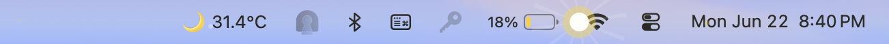
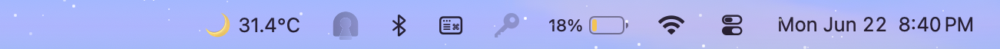
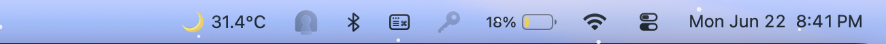

# Weather Menu Bar Overlay

[](https://www.apple.com/macos/)
[](https://swift.org)
[](https://developer.apple.com/xcode/swiftui/)
[](LICENSE)
[](https://open-meteo.com/)
[](#-performance--battery-optimization)
[](https://github.com/rajanchavda/weather-widget/stargazers)
[](https://github.com/rajanchavda/weather-widget/issues)
[](https://github.com/rajanchavda/weather-widget/commits/main)

A beautiful macOS menu bar weather application that displays real-time weather conditions with atmospheric visual effects, twinkling stars on clear nights, and a temperature forecast graph.

## 📸 Screenshots

**☀️ Sunny**


**🌙 Night**


**❄️ Snowy**


**🌫️ Foggy**


## ✨ Features

- **Real-time Weather**: Fetches current weather and 12-hour forecast from Open-Meteo API
- **IP-based Location**: Automatic location detection using IP geolocation
- **Atmospheric Aurora**: Weather-responsive gradient overlays on the menu bar
- **Realistic Animated Weather Effects**:
  - 🌧️ **Rain** - Cinematic 3-layer depth raindrops with wind drift, blue water tint, and ripple splashes
  - ⛈️ **Thunderstorm** - Heavy rainfall with dramatic lightning flashes every 6 seconds
  - ❄️ **Snow** - Gentle snowfall with slow drifting flakes
  - ⭐ **Clear Night** - High-density twinkling stars (6 PM - 6 AM)
- **Day/Night Icons**: Sun ☀️ during day, Moon 🌙 at night
- **Temperature Forecast Line**: Optional graph showing 12-hour temperature trend at the bottom of menu bar
- **Temperature Units**: Switch between Celsius and Fahrenheit
- **Brightness Control**: 4 levels (25%, 50%, 75%, 100%)
- **Auto-refresh**: Updates weather every 5 minutes
- **Low Battery Impact**: Optimized for minimal energy consumption

## 📦 Installation

### Option 1: Install via Homebrew (Recommended)

```bash
brew install rajanchavda/tap/weatheroverlay
```

### Option 2: Build from Source

1. **Clone the repository:**
   ```bash
   git clone https://github.com/rajanchavda/weather-widget.git
   cd weather-widget
   ```

2. **Build the app:**
   ```bash
   swift build -c release
   ```

3. **Run the app:**
   ```bash
   .build/release/WeatherOverlay
   ```

4. **Optional: Copy to Applications folder:**
   ```bash
   # Create an app bundle (manual)
   mkdir -p ~/Applications/WeatherOverlay.app/Contents/MacOS
   cp .build/release/WeatherOverlay ~/Applications/WeatherOverlay.app/Contents/MacOS/
   ```

5. **Launch at Login (Optional):**
   - Go to System Settings → General → Login Items
   - Click "+" and add WeatherOverlay

### Option 3: Open in Xcode

1. Generate Xcode project:
   ```bash
   swift package generate-xcodeproj
   ```

2. Open `WeatherOverlay.xcodeproj` in Xcode

3. Build and run (⌘R)

### Uninstallation

If you installed via Homebrew, you can remove the app by running:
```bash
brew uninstall weatheroverlay
```

To completely remove the app along with any leftover preferences and caches:
```bash
brew uninstall --zap weatheroverlay
```

## 🎮 Usage

The app runs as a menu bar item (no Dock icon). Click the weather icon to access:

- **Atmospheric Aurora** ✓ - Toggle weather-responsive visual effects (enabled by default)
- **Bottom Forecast Line** ☐ - Show/hide 12-hour temperature graph (disabled by default)
- **Temperature Unit** - Choose Celsius (°C) or Fahrenheit (°F)
- **Brightness** - Adjust overlay brightness (25%, 50%, 75%, 100%)
- **Try Different Aurora** 🎨 - Preview all aurora styles without waiting for weather changes:
  - Auto (Weather-based) - Default mode
  - Clear Day - Sunny orange/yellow gradient
  - Clear Night - Night sky with twinkling stars
  - Cloudy - Gray/blue overcast
  - Foggy - Misty white/gray
  - Rainy - Blue/purple rain
  - Snowy - White/cyan frost
  - Thunderstorm - Dark purple storm
- **Reset to Defaults** - Restore all settings to original state
- **Force Refresh Weather** (⌘R) - Manual weather update
- **Quit Weather Overlay** (⌘Q)

## 🌈 Aurora Visual Modes & Animations

The aurora background automatically changes color based on real-time weather conditions (WMO weather codes):

| Weather Type | Aurora Colors | Icon (Day) | Icon (Night) | Animated Effects |
|--------------|---------------|------------|--------------|------------------|
| **Clear** | Orange/Yellow (day)<br>Indigo/Purple (night) | ☀️ | 🌙 | ⭐ Twinkling stars at night |
| **Cloudy** | Gray/Blue | ☁️ | ☁️ | - |
| **Fog** | White/Gray | 🌫️ | 🌫️ | - |
| **Rain/Drizzle** | Blue/Purple | 🌧️ | 🌧️ | 💧 Cinematic 3-layer rain with wind & ripples |
| **Snow** | White/Cyan | ❄️ | ❄️ | ❄️ Gentle drifting snowflakes |
| **Showers** | Blue/Purple | 🌦️ | 🌦️ | 💧 Medium 3-layer rainfall |
| **Snow Showers** | White/Cyan | 🌨️ | 🌨️ | ❄️ Gentle drifting snowflakes |
| **Thunderstorm** | Dark Purple | ⛈️ | ⛈️ | ⚡ Heavy rain + lightning flashes |

**Night Detection**: 6 PM - 6 AM (18:00 - 06:00)

### Animation Details
- **Rain**: 15-40 drops depending on intensity with cinematic features:
  - **3-layer depth system** (near/mid/far) with parallax speed
  - **Variable physics**: 8-14px drop length, depth-based opacity (0.5-0.8)
  - **Wind drift**: Continuous ±3px horizontal sway
  - **Blue water tint**: Natural rain color (not white)
  - **Advanced splashes**: Main splash + outer ripple rings
- **Thunderstorm Lightning**: Full-screen white flashes every 6 seconds (0.15s duration, 25% opacity)
- **Snow**: 25 gentle snowflakes with horizontal drift and sine-wave motion
- **Stars**: 4x density compared to typical apps, deterministic twinkling patterns (1.2-4.7s cycles)

## 📊 Temperature Forecast Line (How It Works)

When enabled, a sleek temperature line graph appears at the bottom of your menu bar:

- **Data**: Shows next 12 hours of temperature forecast
- **Position**: Bottom 6 pixels of menu bar (1-5px from bottom edge)
- **Style**: 2.5px gradient stroke with rounded caps and shadow
- **Y-axis**: Normalized to temperature range (high temps at top, low at bottom)
- **X-axis**: Evenly distributed across full screen width
- **Update**: Refreshes every 5 minutes with new weather data

**Color Gradient** (temperature-based):
- < 0°C: Deep Cyan (freezing)
- 0-15°C: Cool Blue
- 15-22°C: Mild Green/Teal
- 22-30°C: Warm Gold/Yellow
- \> 30°C: Hot Red/Orange

This gives you a quick visual glance at whether temperatures are rising, falling, or staying steady throughout the day.

## ⚡ Performance & Battery Optimization

### Refresh Interval
- **Auto-refresh**: Every **5 minutes** (300 seconds)
- **Manual refresh**: Available via menu (⌘R)
- **Network timeout**: 5 seconds per API request

### Battery Consumption
**Estimated Impact**: ~0.5-2% per hour (very low, varies by weather)

**Real-World Measurements**:
- **Clear/Cloudy** (no animations): ~0.3-0.5% per hour
- **Light Rain/Snow**: ~0.8-1.2% per hour
- **Thunderstorm** (heavy rain + lightning): ~1.5-2% per hour

**On 10-hour MacBook battery**:
- Best case: Lose ~3-5 min/hour = **9.5 hours total**
- Worst case: Lose ~12 min/hour = **9 hours total**

**Why it's optimized:**
1. **Minimal Network Activity**: Only 3 API calls every 5 minutes
   - 1 geolocation request (~2 KB)
   - 1 weather data request (~8 KB)
   - Total: ~10 KB per refresh
   
2. **Efficient Rendering**:
   - **GPU-accelerated Canvas** (Metal rendering, not CPU)
   - Pure vector math (no textures or images)
   - Deterministic animations (no random generation per frame)
   - Tiny render area (screen width × 24px height)
   
3. **Low Resource Usage**:
   - **Memory**: ~57 MB (with animations running)
   - **CPU Idle**: 0-0.5%
   - **CPU Light Rain/Snow**: 1-3%
   - **CPU Thunderstorm**: 3-5%
   
4. **No Background Processing**:
   - Only timer-based wake-ups every 5 minutes
   - No GPS usage (IP-based location)
   - No continuous monitoring

**Comparison**: Uses less battery than most menu bar apps like Spotify (2-3%/hr), Dropbox (1-2%/hr), or Stats monitors (2-4%/hr).

## 🏗️ Architecture

### Core Components

- **AppDelegate** (`main.swift`) - App lifecycle, status bar, overlay window management
- **WeatherManager** (`WeatherManager.swift`) - Weather data fetching, geolocation, state management
- **OverlayView** (`OverlayView.swift`) - SwiftUI visual layer with aurora gradients, stars, and forecast line

### Visual Layers (Z-index bottom to top)

1. **Aurora Background** - Weather-responsive color gradient
2. **Twinkling Stars** - Clear night sky only (deterministic positions)
3. **Temperature Forecast Line** - 12-hour graph at bottom (optional)

### State Management
- **Pattern**: Combine publishers + SwiftUI `@ObservedObject`
- **Flow**: WeatherManager (@Published) → AppDelegate (Combine sink) → OverlayView (@ObservedObject)
- **Thread Safety**: All UI updates on main thread

## 🔧 Technical Details

- **Platform**: macOS 13.0+ (Ventura)
- **Language**: Swift 5.9+
- **Frameworks**: SwiftUI, Cocoa, Combine, Foundation
- **APIs**: 
  - Open-Meteo (weather data, no API key)
  - FreeIPAPI (geolocation, primary)
  - ipapi.co (geolocation, fallback)
- **Dependencies**: None (pure Swift)

## Documentation

- **CLAUDE.md** - Comprehensive technical documentation for AI assistants
- **GEMINI.md** - Detailed project context for AI code analysis

## Project Structure

```
WeatherOverlay/
├── Package.swift
└── Sources/
    ├── main.swift              # AppDelegate + entry point
    ├── OverlayView.swift       # SwiftUI views
    └── WeatherManager.swift    # Weather data layer
```

## License

MIT
